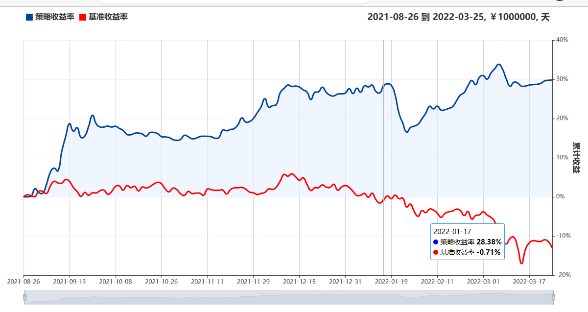
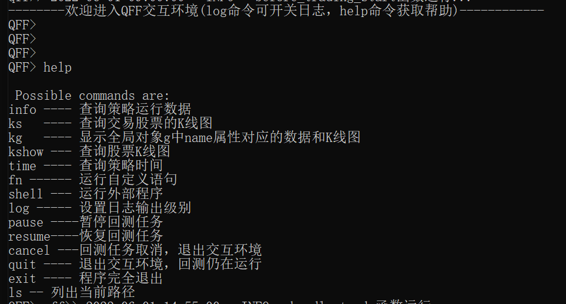

# 快速入门
```{admonition} 说明
我们假设 QFF 已经正确安装在您的系统中，并且已经完成了相应数据库安装和股票数据的下载更新，如果有任何安装相关的问题，请首先查看 [安装指南](installation.md)
```

## 开始编写第一个策略

QFF采用了函数式编程，以API的方式提供给策略研发者用于编写策略，从而避免陷入过多的技术细节，而非金融程序建模本身。


### 下载策略模板
在命令行终端中，创建并进入项目目录，然后运行以下指令：

```bash
$ qff create 
>>>请输入待创建的策略文件名称[默认:example.py]:test
>>>策略文件test.py创建成功!
```

### 编写自己的策略代码

使用Python开发工具 `PyCharm, VsCode, Sublime` 等打开下载的策略模板文件，并添加自己的策略代码。

下面是一个简单而又完整的策略:

```python
from qff import *
import talib as tl
import numpy as np


def initialize():

    # 设置指数基准
    set_benchmark(security="000300")
    # 定义一个全局变量, 保存要操作的股票
    g.s1 = "000001"
    # 定义运行函数
    run_daily(market_open, run_time='09:50')

    log.info("initialize : 初始化运行")


def market_open():
    log.info("market_open函数，每天运行一次...")
    # 读取历史数据
    close = history(100, '1d', 'close', g.s1).close.values
    # 获取当前价格
    current_price = get_current_data(g.s1).last_price
    close = np.append(close, current_price)

    # 用Talib计算MACD取值，得到三个时间序列数组，
    macd, signal, hist = tl.MACD(close, 12, 26, 9)

    # 如果macd从上往下跌破macd_signal
    if macd[-1] < signal[-1] and macd[-2] > signal[-2]:
        # 进行清仓
        if g.s1 in context.portfolio.positions.keys():
            order_target(g.s1, 0)

    # 如果短均线从下往上突破长均线，为入场信号
    if macd[-1] > signal[-1] and macd[-2] < signal[-2]:
        # 满仓买入
        order_value(g.s1, context.portfolio.available_cash)


```

一个完整策略只需要两步:

*   设置初始化函数:[initialize],上面的例子中, 注册一个函数每个交易日09:50执行。
*   编写函数代码, 实现MACD金叉买入，死叉卖出的交易策略。


## 回测自己编写的策略

### 命令行运行

在命令行终端内，执行`qff run --help` 可以查看命令参数说明，然后执行以下语句：

```bash
$ qff run test.py --start 2022-06-01 --end 2022-10-31 
```

### 集成开发环境中运行
 
在策略文件尾部添加以下代码，可以直接运行 `python test.py` 或在集成开发环境中运行。

```python
if __name__ == '__main__':
     run_file(__file__, start="2022-06-01", end="2022-10-31")
```

### 查看策略回测结果

策略回测结束后，将在 `~\.qff\output\back_test\<策略名称>` 目录下保存回测结果，生成两个文件：
1. 一个excel文件，包含：每日资产收益、每日交易订单、每日持仓数据、风险指标、绩效指标等回测分析数据。
2. 一个html文件，展示策略与基准对比收益曲线图形。



## 实盘模拟编写的策略

### 启动实盘模拟
在命令行终端执行以下指令，将启动策略的实盘模拟,设置初始资金10万(默认值100万)。
```bash
$ qff sim test.py  --cash 100000
```

### 执行过程中交互

实盘模拟运行后，将在真实交易时间执行您的策略代码，命令行终端内将连续打印策略的日志信息。
您可以通过输入`log`命令开关日志信息，并输入命令与QFF进行交互，首先输入`help`可以查看所有交互命令。



通过`info`命令可以随时查看策略当前实盘模拟的运行效果。

```{admonition} 说明
QFF交互环境在回测过程同样可以使用。
```