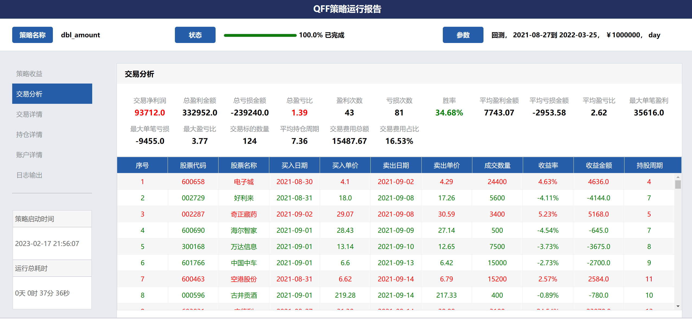
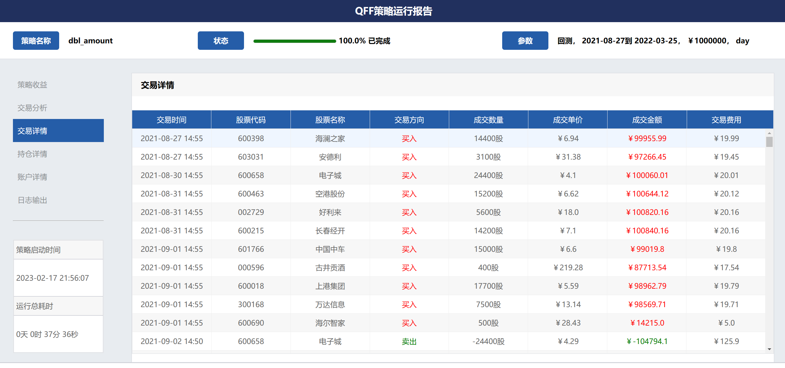
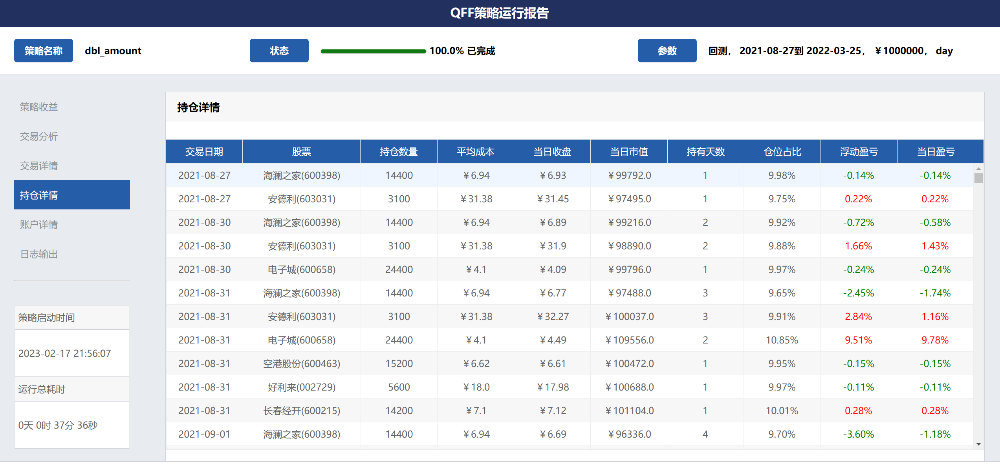
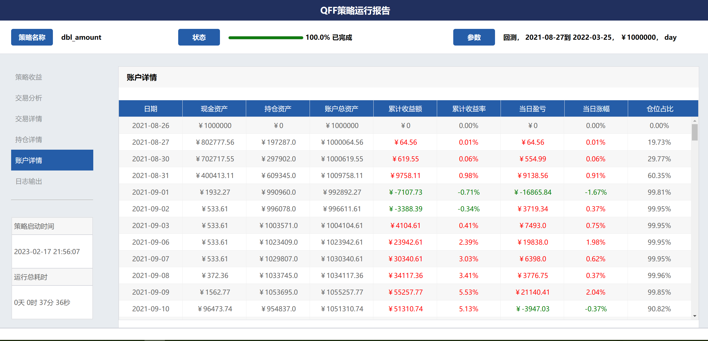
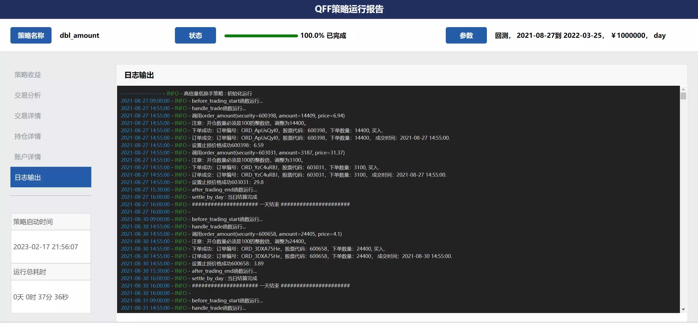

# 策略运行评价

## 策略评价报告
策略评价报告在下列情况下生成：
1. 回测运行完成后，自动生成策略评价报告。
2. 模拟交易每个交易日15:30，会生成从模拟交易起始日期到当前的策略评价报告。
3. 在回测或模拟交易的trace环境中，输入`info 5`命令，会产生当时的评价报告

```{note}
评价报告以html文件格式展现，保存在`~/.qff/output`目录下。

```

### 收益概述页面
策略运行效果在此页面非常友好展现，策略收益率、基准收益、超额收益以及每日仓位占比等信息以曲线图形展示，一目了然。
同时计算了策略运行的各种风险指标。


### 交易分析页面
交易分析将策略运行期间所有买入卖出的订单按先进先出的原则进行配对，由此计算各类绩效指标。关键指标包括盈亏比、胜率、
持仓周期以及交易费用占比等。盈亏比大于1、胜率大于50%的策略都是可选策略。



### 交易详情页面
交易详情页面只是简单罗列策略运行期间的每笔交易，供您进行策略分析。



### 持仓详情页面
持仓详情页面只是简单罗列策略运行期间每日仓位情况，供您进行策略分析。



### 账户详情页面
账户详情页面简单罗列策略运行期间每日账户资产、当日和累计盈亏、当日仓位占比等信息，供您进行策略分析。



### 日志输出页面
日志输出页面调用日志文件，将完整的日志信息在此页面上展示，并对告警和错误信息进行颜色标注。




## 风险指标说明
风险指标数据有利于您对策略进行一个客观的评价,包含以下风险指标：

| 名称                                  |描述|
|:------------------------------------| :--------- |
| [Total Returns](#策略收益)              | 策略收益                          |
| [Total Annualized](#年化收益率)          | 年化收益率|
| [Max Drawdown](#最大回撤)               | 最大回撤|
| [Alpha](#阿尔法)                       |阿尔法|
| [Beta](#贝塔)                         |贝塔|
| [Sharpe Ratio](#夏普比率)               |夏普比率|
| [Sortino Ratio](#索提诺比率)             |索提诺比率|
| [Calmar Ratio](#卡玛比率)             |卡玛比率|
| [Omega Ratio](#欧米茄比率)              |Omega比率|
| [Information Ratio](#信息比率)          |信息比率|
| [Algorithm Volatility](#策略波动率)      |策略波动率|
| [Benchmark Volatility](#基准波动率)      |基准波动率|


### 策略收益
  $$
    \begin{gather}   
    Total\ Returns = (P_{end} - P_{start}) / P_{start} * 100\%    \\
    P_{end}  = 策略最终股票和现金的总价值 \\
    P_{start}  = 策略开始股票和现金的总价值
    \end{gather}
  $$
  
### 年化收益率
年化收益率是用来衡量资产或投资组合的收益率的一种指标，表示资产或投资组合在一年内所获得的平均收益率。

  $$
    \begin{gather}  
    Total\ Annualized\ Returns=R_{p}=((1+P)^{\cfrac{250}{n}} - 1)*100\% \\
    P = 策略收益 \\
    n = 策略执行天数
    \end{gather}
  $$

年化收益率通常用于与其他投资组合或指标进行比较，以评估投资组合的表现。年化收益率还可以用来估算投资组合的未来表现，
但需要注意的是，过去的表现并不一定代表未来的表现，投资者应该谨慎使用。

  
### 最大回撤
描述策略可能出现的最糟糕的情况，最极端可能的亏损情况。

  $$
    \begin{gather}  
    Max\ Drawdown=Max((P_{x}−P_{y})/P_{x}) \\
    P_{x},P_{y}=策略某日股票和现金的总价值，y>x
    \end{gather}
  $$

### 阿尔法
投资中面临着系统性风险（即Beta）和非系统性风险（即Alpha），Alpha是投资者获得与市场波动无关的回报。
比如投资者获得了15%的回报，其基准获得了10%的回报，那么Alpha或者价值增值的部分就是5%。

  $$
    \begin{gather}  
    Alpha=α=R_{p}−[R_{f}+β_{p}(R_{m}−R_{f})] \\
    R_{p}=策略年化收益率 \\
    R_{m}=基准年化收益率 \\
    R_{f}=无风险利率（默认0.04） \\
    β_{p}=策略beta值 \\
    \end{gather}
  $$

| Alpha值|	解释 |
| :------- | :-- |
| α>0 |	策略相对于风险，获得了超额收益 |
| α=0 |	策略相对于风险，获得了适当收益 |
| α<0 |	策略相对于风险，获得了较少收益 |

### 贝塔
表示投资的系统性风险，反映了策略对大盘变化的敏感性。例如一个策略的Beta为1.5，则大盘涨1%的时候，
策略可能涨1.5%，反之亦然；如果一个策略的Beta为-1.5，说明大盘涨1%的时候，策略可能跌1.5%，反之亦然。

  $$
    \begin{gather}  
    Beta=β_{p}=\cfrac{Cov(D_{p},D_{m})}{Var(D_{m})} \\
    D_{p}=策略每日收益 \\
    D_{m}=基准每日收益 \\
    Cov(D_{p},D_{m})=策略每日收益与基准每日收益的协方差 \\
    Var(D_{m})=基准每日收益的方差 \\
    \end{gather}
  $$


|Beta值	|解释|
| :------- | :-- |
|β<0	|投资组合和基准的走向通常反方向，如做空类|
|β=0	|投资组合和基准的走向没有相关性，如固定收益类|
|0<β<1	|投资组合和基准的走向相同，但是比基准的移动幅度更小|
|β=1	|投资组合和基准的走向相同，并且和基准的移动幅度贴近|
|β>1	|投资组合和基准的走向相同，但是比基准的移动幅度更大|


### 夏普比率
夏普比率（Sharpe Ratio）是一种常用的风险调整收益的指标，用于衡量投资组合每承担一单位风险所获得的超额收益。夏普比率越高，
表明每承担一单位风险所获得的超额收益越高，投资组合的风险调整收益能力越强。

  $$
    \begin{gather}  
    Sharpe\ Ratio=\cfrac{R_{p}−R_{f}}{σ_{p}} \\
    R_{p}=策略年化收益率 \\
    R_{f}=无风险利率（默认0.04） \\
    σ_{p}=策略收益波动率 \\
    \end{gather}
  $$

夏普比率衡量投资组合的风险调整收益能力，可以帮助投资者评估投资组合的表现，但需要注意的是，夏普比率存在一定的局限性，主要表现在以下几个方面：

* 假设收益呈正态分布：夏普比率假设收益呈正态分布，但实际上收益可能存在非正态分布，因此可能会影响夏普比率的准确性。
* 无法区分波动率的来源：夏普比率无法区分波动率的来源，因此可能会低估投资组合的整体风险水平。
* 对收益的定义有局限性：夏普比率只考虑了收益的平均值，而没有考虑收益的分布情况，因此可能会忽略收益的非对称分布。

综上所述，夏普比率是一种常用的风险调整收益指标，可以帮助投资者评估投资组合的风险调整收益能力，但在实际应用中需要综合考虑其他因素，并注意其局限性。

### 索提诺比率
表示每承担一单位的下行风险，将会获得多少超额回报。

  $$
    \begin{gather}  
    Sortino\ Ratio=\cfrac{R_{p}−R_{f}}{σ_{pd}} \\
    R_{p}=策略年化收益率 \\
    R_{f}=无风险利率（默认0.04） \\
    σ_{pd}=策略下行波动率 \\
    \end{gather}
  $$

索提诺比率的值越大，代表单位风险所获得的收益越高，也就是说，该投资组合相对于风险而言获得的收益越多，因此索提诺比率越高，代表该投资组合的风险调整收益能力越强。

判断一个投资组合的索提诺比率是否好，需要考虑以下几个因素：

* 索提诺比率的大小：索提诺比率越大，代表投资组合的风险调整收益能力越强，因此索提诺比率越大越好。
* 目标收益率的选择：目标收益率的选择应该根据投资者的需求和市场状况来确定。对于风险偏好较高的投资者，可以选择较高的目标收益率；对于风险偏好较低的投资者，则可以选择较低的目标收益率。同时，目标收益率也需要根据市场状况进行调整。
* 投资组合下行风险的标准差：下行风险指的是收益率低于目标收益率的风险，因此，下行风险的标准差越小，代表投资组合的风险越低，因此索提诺比率越高。
* 历史数据的时间跨度：索提诺比率的计算需要使用历史数据，因此历史数据的时间跨度也会对计算结果产生影响。一般而言，历史数据的时间跨度越长，计算出来的索提诺比率越有参考价值。

需要注意的是，索提诺比率只是一种风险调整收益的指标，不能完全代表一个投资组合的优劣。在实际应用中，还需要综合考虑其他因素，如投资组合的风险水平、投资策略的风格、资产配置等。

### 卡玛比率
卡玛比率（Calmar Ratio）是另一种衡量风险调整收益能力的指标，它将投资组合的年化收益率与最大回撤之比作为风险调整收益的指标，用来评估投资者在承担风险的情况下，获得的收益是否合理。卡玛比率越高，说明投资组合在承担相同的风险下，获得的收益越高，反之亦然。

卡玛比率的公式为：


  $$
    \begin{gather}  
    Calmar\ Ratio=\frac{\text{年化收益率}}{\text{最大回撤}} \\
    \end{gather}
  $$


其中，年化收益率指的是投资组合在一定时间内的平均年化收益率，最大回撤指的是投资组合在某一段时间内最大的下跌幅度。一般情况下，最大回撤是指从高点到低点的跌幅。

与索提诺比率类似，卡玛比率也是一种风险调整收益的指标，可以帮助投资者评估投资组合的风险调整收益能力。与索提诺比率不同的是，卡玛比率将最大回撤考虑在内，更加注重保护资金安全，因此可以帮助投资者更好地控制风险。不过，卡玛比率也有一些局限性，需要综合考虑其他因素，如投资组合的风险水平、资产配置等。

### 欧米茄比率
欧米茄比率（Omega Ratio）是一种金融风险指标，它是一个基于收益率分布的风险调整收益指标，主要用于评估投资组合的风险和收益。

Omega比率的计算公式如下：

  $$
    \begin{gather}  
    Omega\ Ratio=\frac{\text{P}(R > \text{k})}{\text{P}(R < \text{k})}
    \end{gather}
  $$

其中，$\text{P}(R > \text{k})$ 表示收益率大于某个阈值 $\text{k}$ 的概率，$\text{P}(R < \text{k})$ 表示收益率小于等于阈值 $\text{k}$ 的概率。

Omega比率的值越大，代表单位风险所获得的收益越高，也就是说，该投资组合相对于风险而言获得的收益越多，因此Omega比率越高，代表该投资组合的风险调整收益能力越强。

判断一个投资组合的Omega比率是否好，需要考虑以下几个因素：

* Omega比率的大小：Omega比率越大，代表投资组合的风险调整收益能力越强，因此Omega比率越大越好。

* 阈值 $\text{k}$ 的选择：$\text{k}$ 是关键的参数，不同的阈值会对Omega比率的计算结果产生影响。一般而言，阈值的选择应该根据投资者的风险偏好来确定。对于风险偏好较高的投资者，可以选择较高的阈值；对于风险偏好较低的投资者，则可以选择较低的阈值。

* 历史数据的时间跨度：Omega比率的计算需要使用历史数据，因此历史数据的时间跨度也会对计算结果产生影响。一般而言，历史数据的时间跨度越长，计算出来的Omega比率越有参考价值。


需要注意的是，Omega比率只是一种风险调整收益的指标，不能作为独立的评价指标。在评估投资组合时，还需要综合考虑其他指标，如夏普比率、索提诺比率等。


### 信息比率
衡量单位超额风险带来的超额收益。信息比率越大，说明该策略单位跟踪误差所获得的超额收益越高，
因此，信息比率较大的策略的表现要优于信息比率较低的基准。合理的投资目标应该是在承担适度风险下，
尽可能追求高信息比率。

  $$
    \begin{gather}  
    Information\ Ratio=\cfrac{R_{p}−R_{m}}{σ_{t}} \\
    R_{p}=策略年化收益率 \\
    R_{m}=基准年化收益率 \\
    σ_{t}=策略与基准每日收益差值的年化标准差 \\
    \end{gather}
  $$


### 策略波动率
用来测量策略的风险性，波动越大代表策略风险越高。

  $$
    \begin{gather}  
    Algorithm\ Volatility=σ_{p}=\sqrt{\cfrac{250}{n-1} \sum^n_{i=0}(r_{p} - \overset{-}{r_{p}})^2} \\
    r_{p}=策略每日收益率 \\
    \overset{-}{r_{p}}=策略每日收益率的平均值=\cfrac{1}{n} \sum^n_{i=0}r_{pi} \\
    n=策略执行天数
    \end{gather}
  $$
  
### 基准波动率
用来测量基准的风险性，波动越大代表基准风险越高。

  $$
    \begin{gather}  
    Benchmark\ Volatility=σ_{m}=\sqrt{\cfrac{250}{n-1} \sum^n_{i=0}(r_{m} - \overset{-}{r_{m}})^2} \\
    r_{m}=基准每日收益率 \\
    \overset{-}{r_{m}}=基准每日收益率的平均值=\cfrac{1}{n} \sum^n_{i=0}r_{mi} \\
    n=基准执行天数
    \end{gather}
  $$