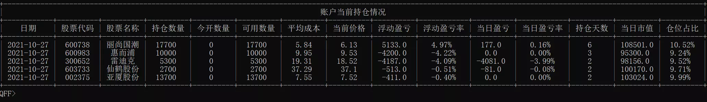
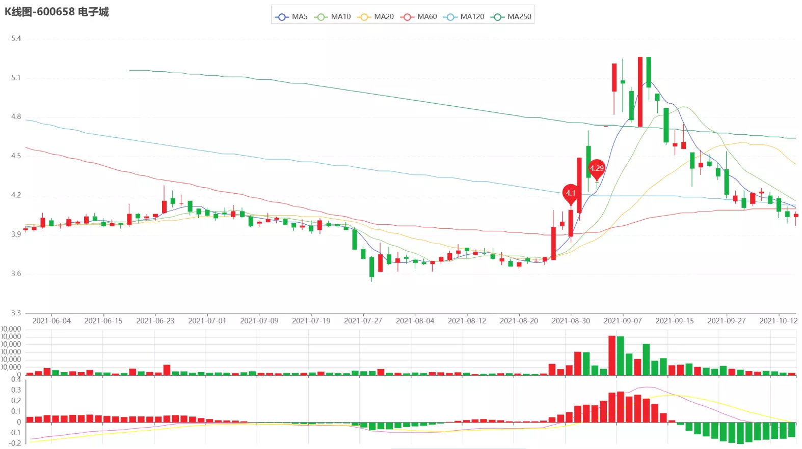

# 策略文件运行


## 回测和模拟
### 回测

```{note} 
 回测是让QFF框架根据一段时间的历史数据模拟执行您编写的策略，根据结果评价并持续改进策略，以获得满意的结果。
```

回测过程如下：
1. 准备好您的策略文件。
2. 选定一个回测开始和结束日期，选择初始资金、执行频率(每天还是每分钟)，开始回测。
3. QFF根据您的策略文件，按照设置的执行频率，模拟历史日期和时间，循环调用您的策略函数。   
4. 当您下单后，QFF会根据接下来时间的实际交易情况，撮合处理您的订单。 
5. 下单后您可以调用get_open_orders取得所有未完成的订单，调用order_cancel取消订单
6. 您可以在任何时候调用log.info/debug/warn/error函数来打印一些日志.
7. 回测结束后我们会生成策略分析报告，画出您的收益和基准(参见 {func}`.set_benchmark` )收益的曲线，
   列出每日持仓，每日交易和一系列风险数据。

### 模拟交易

```{note} 
 模拟交易是在回测的基础上创建的，连接实时的市场数据，根据真实的市场环境进行策略模拟。
```

1. 模拟交易无需设置开始和结束日期，只需选择初始资金和执行频率。从策略执行启动开始，模拟交易就开始运行。
   除非收到结束命令或者外部中断，模拟交易才会结束。
2. 如果执行频率设置为‘每天’，并且启动时已经开盘，则在当前时间点之前运行的函数不再运行，比如: 今天10:00创建了按天的模拟交易,
   代码中实现了 handle_data 和 after_trading_end, 则 handle_data 今天不运行, 而 after_trading_end 会在 15:30 运行。
3. 模拟交易每天收盘后15:30，会生成截止当日的策略分析报告，并且会自动保存运行环境，类似执行暂停操作。
4. 模拟交易运行过程中可以人工干预暂停，暂停时会自动保存context对象和g对象，后期策略重启将会完全恢复暂停前的状态，模拟交易将继续执行。

## 多种方式运行策略
在策略开发过程中，每个人都有各自的需求。例如，他们可能需要在不同的时间周期进行回测，或者希望能够将回测好的策略直接用于实盘交易。
有些人可能更喜欢基于回测数据进行编程分析，或者只是想快速查看收益结果。

为了满足这些不断变化的需求，设计 QFF API 时，将这部分需要以参数方式进行配置的严格剥离出代码层面。这样一来，同一份策略代码可以通过
传入不同的参数来实现完全不同的策略开发、风控、运行和调优等功能。

### 命令行运行

在命令行模式中，我们预先定义了常用的运行参数，您可以直接在控制台输入参数来配置策略的运行，但并不是所有的参数都需要配置，
此处列出一些常用参数选项，您可以执行 `qff run -h` 查询。

| **参数缩写**   | **参数全称** | **说明** |
| :------- | :-- | :-------- | 
| 无 | strategy-file  | 策略文件名称路径        |
| -n | --name  | 策略名称,默认为策略文件名        |
|-rt | --run-type  | 策略运行类型,bt为回测,st为模拟交易,默认为bt  |
| -f | --freq  | 策略执行频率,可选(day, min, tick),默认day | 
| -c | --cash  | 账户初始资金，默认￥1,000,000 |
| -s | --start  | 回测开始日期,默认为结束日期前60个交易日 |
| -e | --end  | 回测结束日期,默认为当日之前最近一个交易日 |
| -f | --freq  | 策略运行结果输出到指定目录,默认<home>/.qff/output/ |
| -t | --trace  | 策略运行过程中是否进行交互,模拟交易时自动生效 |
| 无 | --resume  | 恢复前期暂停的策略运行，一般用于模拟交易中 |
| -l | --log-level | 设置控制台日志输出的级别，可选(verbose,info,warning,error),默认info |

示例：

```bash
# 以回测模式执行当前目录下test.py策略，回测周期2022-06-01至2022-10-31，执行频率天，初始资金1000000
$ qff run test.py -s 2022-06-01 -e 2022-10-31 
```

### 在代码中运行

QFF的一个重要的优势在于支持本地编写和运行用户的策略文件，这样您可以使用PyCharm等集成开发环境提供的如自动代码补全、
代码检查、实时错误高亮等丰富功能，提升策略编写效率，减少代码错误概率。

QFF支持在集成开发环境中运行、调试策略文件的功能，如下所示，在策略文件尾部添加以下代码，调用 {func}`.run_file` 函数可执行（或调试）当前策略。
```python
if __name__ == '__main__':
     run_file(__file__, start="2022-06-01", end="2022-10-31")
```
您也可以直接在命令行策略文件当前目录下输入 `python test.py` 命令，执行策略文件。 

## 运行过程中交互

QFF提供在策略运行过程中的人机交互功能接口trace，模拟交易时在控制台自动打开.

您可以通过输入`log`命令开关控制台日志信息（日志文件保存不受影响），并输入命令与QFF进行交互，首先输入`help`可以查看所有交互命令。


### 命令总览

| **命令**   | **说明** |
| :------- | :-- | 
| info | 查询策略运行数据 |
| ks   | 查询交易股票的K线图 |
| kg   | 显示全局对象g中name属性对应的数据和K线图 |
| kshow | 查询股票K线图 | 
| time  | 查询策略时间|
| fn    | 运行自定义语句|
| shell | 运行外部程序|
| log   | 设置日志输出级别|
| pause | 暂停策略运行 |
| resume| 恢复策略运行 |
| cancel| 策略运行取消，退出交互环境 |        
| quit  | 退出交互环境，回测仍在运行 |        
| exit  | 程序完全退出 |               
| ls    | 列出当前路径|            

```{note}
回测时需通过参数`-t`打开trace功能, 如果日志输出太频繁，可能无法通过 `log` 命令关闭，可在启动时添加参数 `-l warning`

```

### 查询策略运行数据

info命令可以查看策略当前运行的状态和数据，直接输入`info`命令将显示以下子命令信息：

| **子命令**   | **说明** |
| :------- | :-- | 
| info 0 | 输出回测框架/模拟实盘运行基本参数        |
| info 1 | 输出当前股票账户资金状况及当前账户持仓情况详情   |
| info 2 | 输出策略运行历史账户资产数据            |
| info 3 | 输出策略运行历史订单交易数据            |
| info 4 | 输出策略运行当日订单委托信息            |
| ------ | ------------------------------------|
| info 5 | 输出策略运行分析报告            |
| info 6 | 输出策略风险分析指标数据         |
| info 7 | 输出策略绩效分析指标数据         |

示例：
```bash
QFF>
QFF>info 1

```
命令行输出：
```{image} ../_static/info1-0.webp
:class: bg-primary
:width: 200px
:align: center
```



### 查看股票K线图

trace模块提供了三种查看k线图命令，方便您在模拟交易（或回测运行）中随时生成并查看股票的K线。

1. kshow命令

kshow命令输入需观察的股票代码，在临时目录`~/.qff/temp`下生成k线图文件`kline_chart.html`，如果是windows系统，将自动打开默认浏览器。
kshow命令语法如下：

```{eval-rst} 

            =========================  ==============================================================
             kshow 000001               从当前日期（或回测运行）查询指定股票代码的日K线，默认500条数据  
             kshow 000001 200           从当前日期（或回测运行）查询指定股票代码的日K线，显示设置的数据条数 
             kshow 000001 -20           在回测状态下，查询当前日期前500条到后20条数据。         
             kshow index 000001         从当前日期（或回测运行）查询指数代码的日K线，默认500条数据    
             kshow index 000001 200     从当前日期（或回测运行）查询指数代码的日K线，显示设置的数据条数   
            =========================  ==============================================================
```

2. ks命令

ks命令用于查看历史成交记录中股票的K线图，并标注买卖点。用于分析策略买点和卖点的正确性。

ks命令语法：

* ks:不带参数运行将输出当前已经配对的成交记录列表。
* ks n: 生成以上成交记录列表中第n条记录对应的股票k线图，并标注买入卖出点。



3. kg命令

kg命令用于分析保存在g全局变量中定义股票池中的股票，这些股票被您的策略代码选中，但未被成功买入。
此时，您可能希望掌握选中和未交易成功的原因，trace模块提供了kg命令能够让您快速查看。

kg命令语法：

* kg name: 显示全局对象g中name属性对应列表中的数据。g.name为列表对象，g.name列表中数据项如需进行K线显示，需满足以下格式：               
                             [股票代码，标注点1日期，标注点1价格，标注点2日期，标注点2价格，其他信息...]
* kg name n: 显示全局对象g中name属性对应列表中股票的日K线，并标注信息点,n代表第n条数据。  

示例：
```bash
QFF>
QFF>kg lost_stocks
# 您需要在您的策略代码中，将股票池中未成交或丢弃的股票添加至g.lost_stocks中
```

## 暂停和恢复

模拟交易时，策略根据真实的市场环境，启动后将持续运行。您可能希望策略只在交易时间内运行，
或者执行一段时间后希望少量优化您的代码，此时您需要进行暂停和恢复操作。

### 暂停
暂停方法有以下两种：
1.  在trace人机交互环境中，输入`pause`命令，策略将启动暂停操作，此时提示您输入备份文件名称，并提供默认文件名（策略文件名_sim.pkl），
    直接回车则选择默认文件名称。QFF会通过pickle.dumps函数序列化context和g两个全局变量写入备份文件中，然后策略退出运行。
    备份文件保存在`~/.qff/cache`目录下，您在trace中输入exit命令，则完全退出进程。


2. 模拟交易每天15:30会自动保存运行环境，并以默认文件名称保存备份文件在`~/.qff/cache`目录下，您可以在after_trading_end接口函数中，
添加 `sys.exit(1)` 退出策略模拟交易进程。
   
```{note} 
 暂停时使用默认文件名称，会覆盖以前的备份文件，即只保存最新的策略运行环境。
```

### 恢复

通过命令行参数，有两种方法进行恢复操作：
1. 如果您使用默认文件作为备份文件名，则您可以通过 `qff run <您的策略文件名称> --resume` 命令，恢复最后一次暂停时备份的运行环境。

2. 如果您使用自己命名的备份文件名称，则您可以通过 `qff resume <您的备份文件名称> ` 命令，恢复您指定pkl文件所保存的运行环境。

```{note} 
 如果您希望只在交易时间运行模拟交易，可以将`qff run <您的策略文件名称> --resume`命令设置在您的定时任务中，启动时间需设置在交易日09:00前。
```