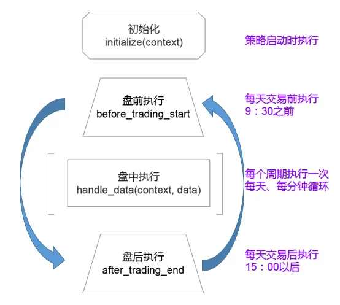

# 策略文件编写

一个完整的策略包括选股、择时、止盈、止损、风险控制、仓位控制等几部分内容，QFF框架为您实现策略提供了所有的支持。
我们从最基础的策略入手，推荐以下编写策略文件思路：

1. 在开盘前执行复杂耗时的策略代码，比如针对历史行情或基本面数据筛选当日的股票池，或者判断当前的大盘环境以决策当日的仓位等。
2. 在盘中阶段，如果策略执行频率是分钟或者tick，应该尽量减少策略逻辑的复杂度，
   比如：可以根据待选股票当日的走势判断决策是否买入，或者进行止盈止损操作等。
3. 收盘后由于此时当日行情数据还未保存至数据库，只能分析和输出当日的操作结果。   

以下是实现策略代码的关键API说明：

## 框架接口函数
用户编写的策略文件中必须包含（或部分包含）以下约定的框架接口函数，并根据策略逻辑将代码分别放置不同的函数来实现。
QFF框架正确载入策略文件后，会自动在相应的时间调用这些函数。 

| **接口名称**   | **描述** |
| :------- | :-- |
| [initialize](api_initialize)   | 初始化函数(必须) |
| [handle_data](api_handle_data)  | 盘中策略运行函数(可选) |
| [before_trading_start](api_before_trading_start)| 开盘前运行策略(可选) |
| [after_trading_end](api_after_trading_end)| 收盘后运行策略(可选) |
| [on_strategy_end](api_on_strategy_end)| 策略运行结束时调用(可选) |
| [process_initialize](api_process_initialize) | 每次程序启动时运行函数(可选) |


```{warning} 
**注意:** 如果是使用框架接口函数,请严格按照API中的名称参数进行定义。如果要自定义函数,
请避免和框架接口函数重名,否则将引起报错。
```
### 框架流程图




### 运行时间
策略代码什么时候运行，主要由设置策略频率（天、分钟或者tick）与框架接口函数共同完成。

* before_trading_start： 与策略频率无关，每个交易日开盘前运行，这里设计为09:00运行。
* after_trading_end：与策略频率无关，每个交易日收盘后运行，这里设计为15:30运行。
* handle_data: 此函数实现策略逻辑的核心代码，是在交易日盘中运行，具体运行时间取决于策略运行频率。

### 运行频率

策略运行频率可以理解为函数的调用频率,也就是盘中阶段您多久去看一眼K线图。从整个策略层面上讲,
QFF有三种不同粒度的频率,分别为(天,分钟,tick):

1. 天级别:  handle_data的执行时间为09:31时执行一次。

2. 分钟级别: handle_data在股票的交易时间段中每分钟执行一次。

3. tick级别: handle_data在股票的交易时间段中每3秒执行一次。**tick级别仅支持模拟交易中使用，回测不能使用** 

```{note} 
 **注意：** 每日分钟k线数据9:31-11:00 13:01-15:00，共240条数据
```
4. 自定义运行频率: 
一般来讲,自定义运行频率可以使用三种方法,一种就是通过定时器去判断执行次数,在一定的执行次数下再执行后边需要执行的代码;第二种是判断时间,当当前时间的分钟是某个数字的倍数时再运行,比如现在是09:50,50是10的倍数,执行,否则跳过;第三种是直接设置多个定时运行。

示例：
```python

  def initialize(): #这里选择策略频率为分钟,所以func函数每分钟都会执行一次
    g.run_num = -1  #初始化计数器,不要在盘中开启策略

  def handle_data():
    g.run_num += 1
    if g.run_num!=15:  #如果这次运行的次数不是15,打断此次运行
        return       
    else:
        g.run_num=0  #条件满足,计数器归零,继续后边的代码

    print('后边的代码将每隔15分钟运行一次')
```

### 定时运行
用户可以通过在initialize()函数中调用 {func}`.run_daily` 函数设置定时运行的策略代码。

```python

  def initialize(): 
    # 设置每个交易日09:40运行策略函数my_fun1()  
    run_daily(my_fun1, run_time='09:40')
    # 设置每个交易日10:40运行策略函数my_fun1()
    run_daily(my_fun1, run_time='10:40')
    # 设置每个交易日14:10运行策略函数my_fun2()
    run_daily(my_fun2, run_time='10:40')


  def my_fun1():
      # 打印运行的时间
    print('my_fun1运行{}'.format(context.current_time))

  def my_fun2():
      # 打印运行的时间
    print('my_fun2运行{}'.format(context.current_time))

```

* 如果策略文件中自定义的函数有通过run_daily进行注册，则根据注册时的参数，系统会自动以固定的时间调用注册的函数。
* 通过设置run_daily的run_time参数，可以替代其他框架约定接口函数，具体参考[run_daily API](api_run_daily)。
* 定时运行的时间必须在盘中时间，即9:31-11:00 13:01-15:00 。
* 可以在相同的时间点设置不同的策略函数, 也可以在不同的时间点设置相同的策略函数，但要避免与框架接口函数重名。
* 如果用户自定义的函数没有进行注册，且函数名不属于框架接口函数，则系统不会主动调用。

```{note}
一个策略中尽量不要同时使用run_daily和handle_data，更不能使用run_daily(handle_data, "xx:xx")，建议使用run_daily。
```

## 数据获取函数

理解策略程序框架，您就可以开始编写策略了，但策略的实现需要基于股票数据的分析，以决定股票买卖的信号。QFF提供了丰富的数据查询API,
包括股票、指数、基金的行情数据、基本面数据以及融资融券数据等，具体参考[数据API](../api/data_api)

### 历史数据

策略文件一般在开盘前（before_trading_start函数中）进行选股或大盘择时等策略的实现，此时需
获取策略运行当日之前的历史数据，在回测中，历史数据的获取非常容易用到未来函数，从而造成策略结果失真。
例如开盘前获取当天的收盘价、财务数据、技术指标等。为了避免未来函数，我们提供的大多数函数支持获取历史任意时刻信息。

以下是常用到的一些函数说明：

| **接口名称**   | **功能** | **备注** |
| :------- | :-- | :-- |
| {func}`.get_price`  | 获取历史数据,可查询多个标的多个数据字段 | 避免在策略中使用，容易产生未来函数 |
| {func}`.history`  | 获取历史数据,可查询多个标的单个数据字段(**回测专用**) | 无未来函数 |
| {func}`.attribute_history`  | 获取历史数据,可查询单个标的多个数据字段(**回测专用**) | 无未来函数 |
| {func}`.get_bars`  |  获取历史数据(包含快照数据),可查询多个标的多个数据字段(**回测专用**) | 无未来函数 |
| {func}`.get_all_securities`  | 获取平台支持的所有股票信息 | 给参数date赋值为context.previous_date |
| {func}`.get_stock_name`  | 获取股票给定日期的名称 |给参数date赋值为context.previous_date |
| {func}`.get_index_stocks`  | 获取一个指数给定日期的成分股列表 |给参数date赋值为context.previous_date |
| {func}`.get_financial_data`  | 查询多只股票给定日期的财务数据 |给参数date赋值为context.previous_date |
| {func}`.get_fundamentals`  | 根据mongodb语法查询财务数据|注意查询日期赋值|
| {func}`.query_valuation`  |  查询满足条件的市值信息数据 |注意查询日期赋值|

其他函数参考[数据API](../api/data_api)


### 当前数据
在handle_data函数实现的盘中策略逻辑中，需根据股票当前时刻价格进行判断，以决定股票买卖的信号。
QFF提供 {func}`.get_current_data` 函数获取回测或模拟实盘中当前时刻标的数据，数据内容参见 {class}`.UnitData`类。

示例：
```python
    def initialize(): 
        g.stock = '000001' 
        
    def handle_data():
        data = get_current_data(g.stock)
        if data.last_price / data.pre_close - 1 > 0.05:
            log.info("股票{}当前涨幅大于5%！".format(g.stock))
        
```

**注意： get_current_data函数只能够在盘中运行的策略中使用**

### 全局对象

策略代码编写时，会经常使用到下面两个全局变量对象，其他所有的类和对象，请参考[基础API](api-base-types)

**1. 全局对象g:** 

g对象用来存储用户的各类可被pickle.dumps函数序列化的全局数据，即需在不同策略函数中使用的变量，可定义成g对象的属性，这些变量在策略暂停后，会自动保存，并在策略恢复运行后，变量值能够恢复。 

示例：

```python

    def initialize(): 
        g.stock = '000001' 

    def handle_data():
        log.info("g.stock值为{}".format(g.stock))
        
```
**如果不想 g 中的某个变量被序列化, 可以让变量以 ‘__’ 开头, 这样, 这个变量在序列化时就会被忽略。**

**2. 全局对象context:**  

 context对象保存了策略运行过程中的上下文环境。包括策略的账户信息、运行参数以及当前运行状态。对象数据内容参见 {class}`.Context`类。 
 
用户可以在策略代码中直接读取context相关属性,但注意**不能直接修改context的任何属性值**。

示例：

```python
    def handle_data():
        log.info("账户初始金额为{}".format(context.portfolio.starting_cash))
        log.info("账户当前可用金额为{}".format(context.portfolio.available_cash))
        
```

## 交易执行函数
至此，我们已经能够获取股票数据，并可通过代码实现买卖信号逻辑，那么接下来就需要调用交易接口来进行交易了。

### 交易函数接口
QFF提供了了多种交易接口，以方便不同的使用需求：

```{eval-rst} 

.. currentmodule:: qff.frame.order

.. autosummary::
   :nosignatures:

   order
   order_value
   order_target
   order_target_value
   order_cancel
   get_orders
   get_open_orders
   
    
```

### 订单交易流程

1. 从委托到成交的流程: 订单创建->订单检查->报单->确认委托->撮合，在订单检查时未通过则订单取消。

2. 为简化操作，QFF未启用盘口撮合，撮合时不考虑成交量,一个订单一次成交记录。
   * 市价单买入时按当前价格+滑点价格，转成限价单。如果当前价格为涨停价格，则订单取消。
   * 市价单卖出时按当前价格-滑点价格，转成限价单。如果当前价格为跌停价格，则订单取消。
3. 订单撮合规则： 
    * 如果运行频率为天，则下单后立即撮合，读取剩余的分钟数据曲线,判断最高价是否大于委托价，是则成交。
    * 如果运行频率为分钟（或tick），则下单后，每分钟（或tick）都判断该订单是否符合成交条件。
4. 对未成交的订单，在本交易日结束后撤销。


