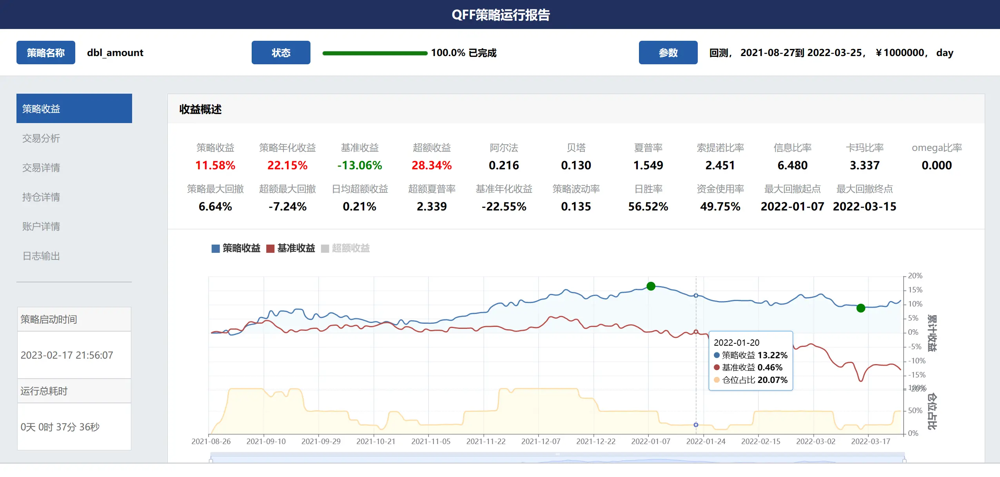
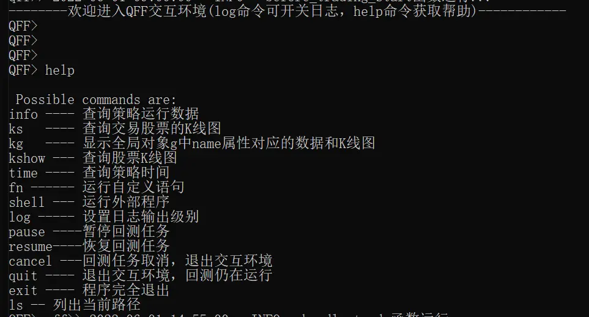

# 快速入门
QFF框架读取用户编写的策略文件，根据输入的执行参数进行回测或模拟交易，并在执行完成后自动生成相应的策略评价报告。

```{admonition} 说明
我们假设 QFF 已经正确安装在您的系统中，并且已经完成了相应数据库安装和股票数据的下载更新，如果有任何安装相关的问题，请首先查看 [安装指南](installation.md)
```

## 开始编写第一个策略

QFF采用了函数式编程，以API的方式提供给策略研发者用于编写策略，从而避免陷入过多的技术细节，而非金融程序建模本身。


### 下载策略模板
在命令行终端中，创建并进入项目目录，然后运行以下指令：

```bash
$ qff create 
>>>请输入待创建的策略文件名称[默认:example.py]:test
>>>策略文件test.py创建成功!
```

### 编写自己的策略代码

使用Python开发工具 `PyCharm, VsCode, Sublime` 等打开下载的策略模板文件，并添加自己的策略代码。

下面是一个简单而又完整的策略:

```python
# 导入函数库
from qff import *


# 初始化函数，设定基准等等
def initialize():
    # 输出内容到日志 log.info()
    log.info('初始函数开始运行且全局只运行一次')

    # 设定沪深300作为基准
    set_benchmark('000300')

    # 股票相关设定 ###
    # 股票类每笔交易时的手续费是：买入时佣金万分之三，卖出时佣金万分之三加千分之一印花税, 每笔交易佣金最低扣5块钱
    set_order_cost(open_tax=0,
                   close_tax=0.001,
                   open_commission=0.0003,
                   close_commission=0.0003,
                   min_commission=5)

    # 开盘前运行
    run_daily(before_market_open, run_time='before_open')
    # 开盘时运行
    run_daily(market_open, run_time='every_bar')
    # 收盘后运行
    run_daily(after_market_close, run_time='after_close')


# 开盘前运行函数
def before_market_open():
    # 输出运行时间
    log.info('函数运行时间(before_market_open)：' + context.current_dt)

    # 要操作的股票：平安银行（g.为全局变量）
    g.security = '000001'


# 开盘时运行函数
def market_open():
    log.info('函数运行时间(market_open):'+context.current_dt)
    security = g.security
    # 获取股票的收盘价
    close_data = attribute_history(security, count=5, unit='1d', fields=['close'])
    # 取得过去五天的平均价格
    MA5 = close_data['close'].mean()
    # 取得上一时间点价格
    current_price = close_data['close'][-1]
    # 取得当前的现金
    cash = context.portfolio.available_cash

    # 如果上一时间点价格高出五天平均价1%, 则全仓买入
    if (current_price > 1.01*MA5) and (cash > 0):
        # 记录这次买入
        log.info("价格高于均价 1%%, 买入 %s" % security)
        # 用所有 cash 买入股票
        order_value(security, cash)
    # 如果上一时间点价格低于五天平均价, 则空仓卖出
    elif current_price < MA5 and context.portfolio.positions[security].closeable_amount > 0:
        # 记录这次卖出
        log.info("价格低于均价, 卖出 %s" % security)
        # 卖出所有股票,使这只股票的最终持有量为0
        order_target(security, 0)


# 收盘后运行函数
def after_market_close():
    log.info(str('函数运行时间(after_market_close):'+context.current_dt))


```

一个完整策略只需要两步:

*   设置初始化函数:[initialize],上面的例子中, 注册一个函数每个交易日09:50执行。
*   编写函数代码, 实现突破5日均线买入，下穿5日均线卖出的策略。


## 回测自己编写的策略

### 命令行运行

在命令行终端内，执行`qff run -h` 可以查看命令参数说明，然后执行以下语句：

```bash
$ qff run test.py -s 2022-06-01 -e 2022-10-31 
```

### 集成开发环境中运行
 
调用 {func}`.run_file` 函数执行当前策略，在策略文件尾部添加以下代码，您可以直接在终端运行 `python test.py` 或在集成开发环境中运行。

```python
if __name__ == '__main__':
     run_file(__file__, start="2022-06-01", end="2022-10-31")
```

### 查看策略回测结果

策略回测结束后，将在 `~\.qff\output\back_test\` 目录下保存回测结果，生成两个文件：
1. 一个pkl文件，包含策略运行过程中context对象的所有信息
2. 一个html文件，即策略运行报告。



## 实盘模拟编写的策略

### 启动实盘模拟
在命令行终端执行以下指令，将启动策略的实盘模拟,设置初始资金10万(默认值100万)。
```bash
$ qff sim test.py  --cash 100000
```

### 执行过程中交互

实盘模拟运行后，将在真实交易时间执行您的策略代码，命令行终端内将连续打印策略的日志信息。
您可以通过输入`log`命令开关日志信息，并输入命令与QFF进行交互，首先输入`help`可以查看所有交互命令。



通过`info`命令可以随时查看策略当前实盘模拟的运行效果。

```{admonition} 说明
QFF交互环境在回测过程同样可以使用。
```